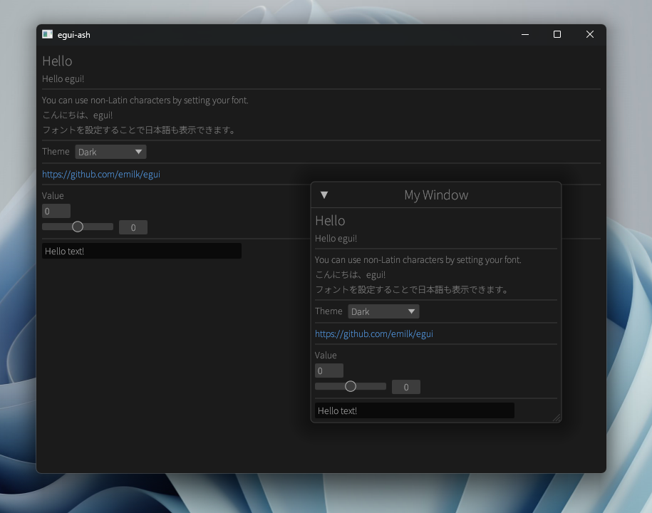
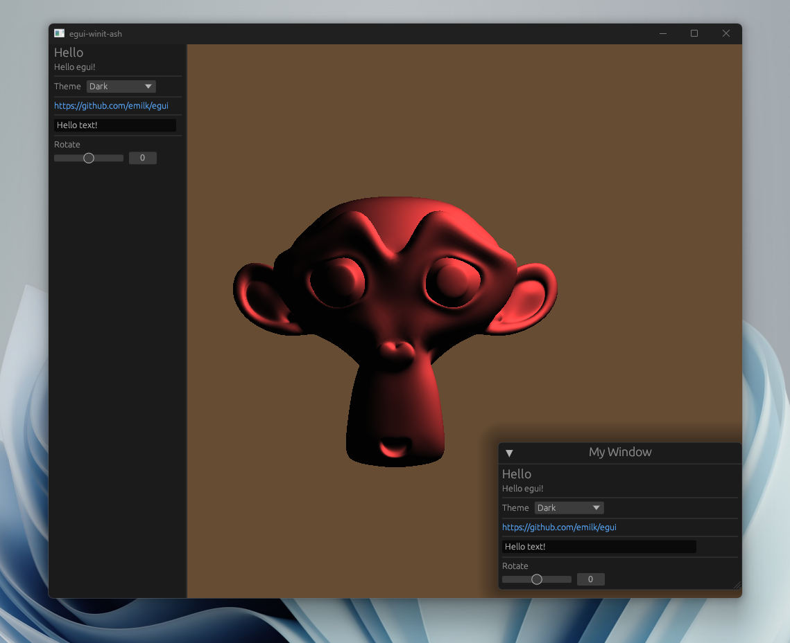
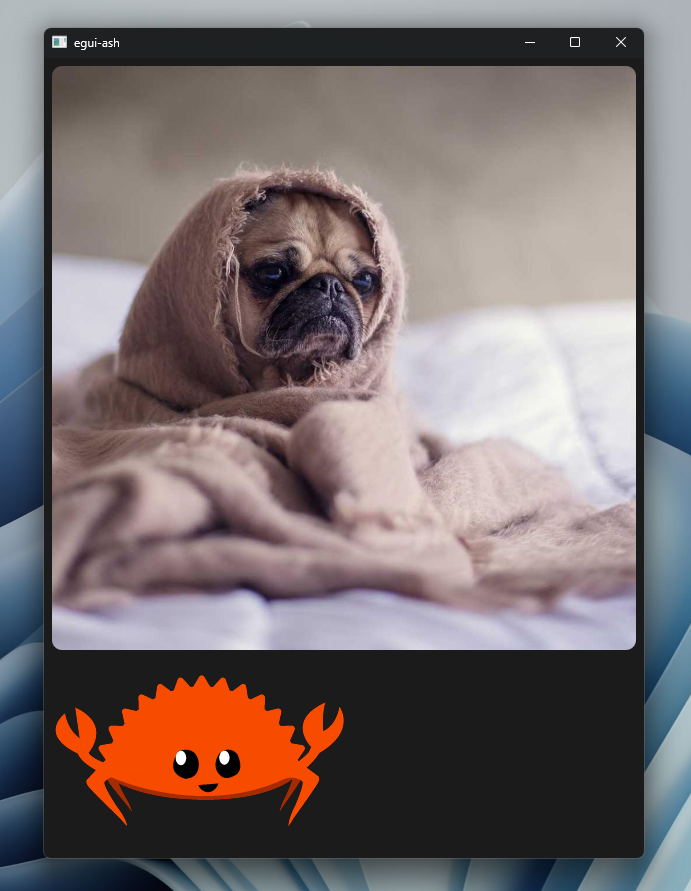
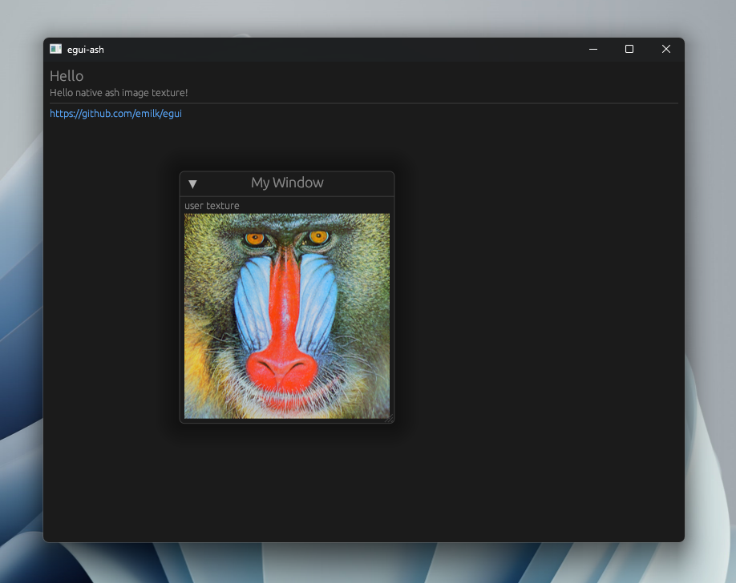
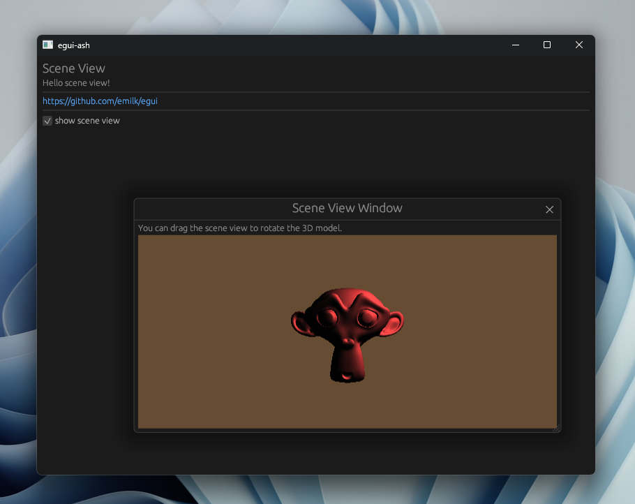
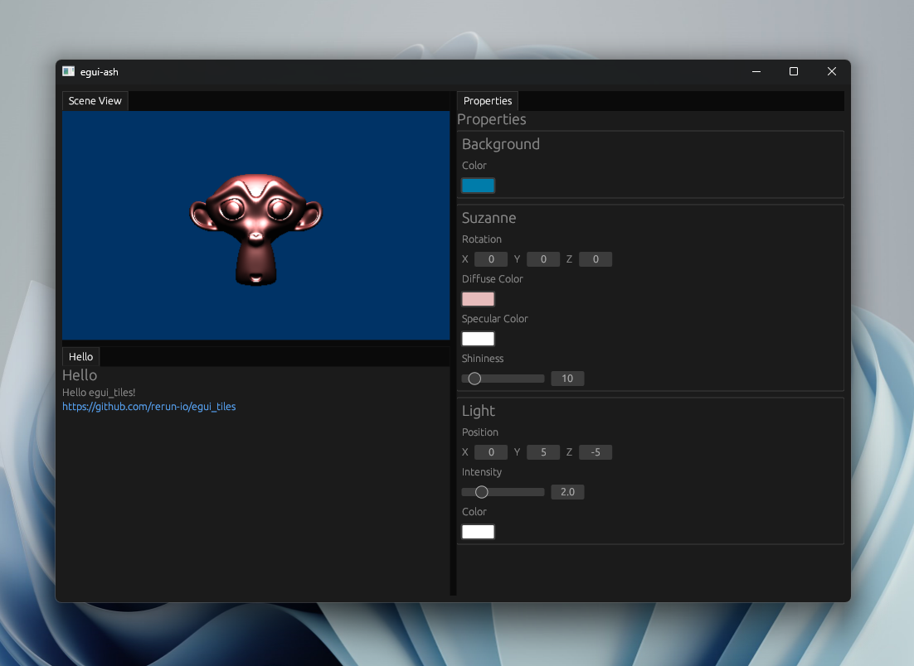

# egui-ash

[](https://crates.io/crates/egui-ash)
[](https://docs.rs/egui-ash)


[](https://docs.rs/egui/0.24.1/egui)
[](https://docs.rs/ash/0.37.3/ash)

[egui](https://github.com/emilk/egui) integration for [ash](https://github.com/MaikKlein/ash) (Vulkan).

This crate natively supports the multi-viewports feature added since version 0.24 of egui.

You can use [gpu_allocator](https://github.com/Traverse-Research/gpu-allocator) as the default allocator by the `gpu-allocator` feature.
You can also use your own allocator by implementing the `Allocator` trait.

## Example

### simple



```
cargo run --release --example egui_ash_simple
```

### vulkan



```
cargo run --release --example egui_ash_vulkan
```

### images



```
cargo run --release --example images
```

### multi viewports


```
cargo run --release --example multi_viewports
```

### native images



```
cargo run --release --example native_image
```

### scene view



```
cargo run --release --example scene_view
```

### tiles



```
cargo run --release --example tiles
```

## Usage

```rust
// (1) Create a App struct that implements the `egui_ash::App` trait.
struct MyApp;
impl egui_ash::App for MyApp {
    fn ui(
        &mut self,
        ctx: &egui::CtxRef,
        integration_context: &mut egui_ash::IntegrationContext,
    ) {
        // (2) draw ui here
        egui::Window::new("Hello world").show(ctx, |ui| {
            ui.label("Hello world!");
        });
    }

    fn request_redraw(&mut self, _viewport_id: egui::ViewportId) -> HandleRedraw {
      // (3) return `HandleRedraw::Auto` if you want to draw only egui.
      HandleRedraw::Auto
      // (4) ...or return `HandleRedraw::Handle` if you want to draw with ash.
      // NOTE: You must call `egui_cmd.update_swapchain` inside render function
      // when you first render and when you recreate the swapchain.
      HandleRedraw::Handle(Box::new(|size, egui_cmd| render(size, egui_cmd)))
    }
}

// (5) Create a AppCreator struct that implements the `egui_ash::AppCreator` trait.
struct MyAppCreator;
impl egui_ash::AppCreator for MyAppCreator {
    type App = MyApp;

    // (6) new method receives `egui_ash::CreationContext` and
    // returns `Self::App` and `egui_ash::AshRenderState`.
    fn new(&self, cc: CreationContext) -> (Self::App, AshRenderState<Arc<Mutex<Allocator>>>) {
        // create vk objects
        let entry = create_entry();
        let (instance, debug_utils_loader, debug_messenger) =
            create_instance(&cc.required_instance_extensions, &entry);
        let surface_loader = create_surface_loader(&entry, &instance);
        let surface = create_surface(&entry, &instance, cc.main_window);
        let (physical_device, _physical_device_memory_properties, queue_family_index) =
            create_physical_device(
                &instance,
                &surface_loader,
                surface,
                &cc.required_device_extensions,
            );
        let (device, queue) = create_device(
            &instance,
            physical_device,
            queue_family_index,
            &cc.required_device_extensions,
        );
        let swapchain_loader = create_swapchain_loader(&instance, &device);
        let command_pool = create_command_pool(&device, queue_family_index);

        // create allocator
        let allocator = {
            Allocator::new(&AllocatorCreateDesc {
                instance: instance.clone(),
                device: device.clone(),
                physical_device,
                debug_settings: Default::default(),
                buffer_device_address: false,
                allocation_sizes: Default::default(),
            })
            .expect("Failed to create allocator")
        };
        let allocator = Arc::new(Mutex::new(allocator));

        let ash_render_state = AshRenderState {
            entry,
            instance,
            physical_device,
            device,
            surface_loader,
            swapchain_loader,
            queue,
            queue_family_index,
            command_pool,
            allocator,
        };

        (Self, ash_render_state)
    }
}

// (7) Call `egui_ash::run` with `AppCreator` struct.
fn main() {
    egui_ash::run(
        MyAppCreator,
        RunOption {
            viewport_builder: Some(egui::ViewportBuilder::default().with_title("egui-ash")),
            ..Default::default()
        },
    )
}
```

[Full example is in examples directory](https://github.com/MatchaChoco010/egui-ash/tree/main/examples)

## Feature flags

### `gpu-allocator` - Enables the gpu-allocator crate.
This feature allows `Arc<Mutex<gpu_allocator::vulkan::Allocator>>` to be used as an allocator to be used by egui-ash.

### `persistence` - Enables the persistence feature of egui.
With this feature, setting `persistent_windows` and `persistent_egui_memory` in RunOption to `true` will preserve Window size and position, as well as scale factor, etc.

### other features
The other features directly control the underlying [egui_winit features](https://docs.rs/egui-winit/latest/egui_winit/)

## License

MIT OR Apache-2.0
